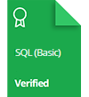

    

# HackerRank | Practice, Tutorials & Interview Preparation Solutions

This repository consists of my solutions to HackerRank **practice**, **tutorials**, and **interview preparation** problems with **C#**, **SQL**, **C++**, **Java**, , and **JavaScript**.

## Personal HackerRank Profile

[View Profile](https://www.hackerrank.com/ziankabir)

## HackerRank Badges

## HackerRank Certificates

## Tutorials Completed

### 30 Days of Code

|  Day  |                Challenge                |                                         Problem                                          | Difficulty | Score |                                                          C#                                                          |
| :---: | :-------------------------------------: | :--------------------------------------------------------------------------------------: | :--------: | :---: | :------------------------------------------------------------------------------------------------------------------: |
|   0   |              Hello, World               |         [Problem](https://www.hackerrank.com/challenges/30-hello-world/problem)          |    Easy    |  30   |                   [Solution](/30%20Days%20of%20Code/Day%200%20-%20Hello%20World.cs)                                  |
|   1   |               Data Types                |          [Problem](https://www.hackerrank.com/challenges/30-data-types/problem)          |    Easy    |  30   |                    [Solution](/30%20Days%20of%20Code/Day%201%20-%20Data%20Types.cs)                                  |
|   2   |                Operators                |          [Problem](https://www.hackerrank.com/challenges/30-operators/problem)           |    Easy    |  30   |                     [Solution](/30%20Days%20of%20Code/Day%202%20-%20Operators.cs)                                    |
|   3   |     Intro to Conditional Statements     |    [Problem](https://www.hackerrank.com/challenges/30-conditional-statements/problem)    |    Easy    |  30   |       [Solution](/30%20Days%20of%20Code/C%23/04%20-%20Day%203%20-%20Intro%20to%20Conditional%20Statements.cs)        |
|   4   |           Class vs. Instance            |      [Problem](https://www.hackerrank.com/challenges/30-class-vs-instance/problem)       |    Easy    |  30   |             [Solution](/30%20Days%20of%20Code/Day%204%20-%20Class%20vs.%20Instance.cs)                               |
|   5   |                  Loops                  |            [Problem](https://www.hackerrank.com/challenges/30-loops/problem)             |    Easy    |  30   |                       [Solution](/30%20Days%20of%20Code/Day%205%20-%20Loops.cs)                                      |
|   6   |              Let's Review               |         [Problem](https://www.hackerrank.com/challenges/30-review-loop/problem)          |    Easy    |  30   |                   [Solution](/30%20Days%20of%20Code/Day%206%20-%20Let's%20Review.cs)                                 |
|   7   |                 Arrays                  |            [Problem](https://www.hackerrank.com/challenges/30-arrays/problem)            |    Easy    |  30   |                       [Solution](/30%20Days%20of%20Code/C%23/08%20-%20Day%207%20-%20Arrays.cs)                       |
|   8   |          Dictionaries and Maps          |    [Problem](https://www.hackerrank.com/challenges/30-dictionaries-and-maps/problem)     |    Easy    |  30   |             [Solution](/30%20Days%20of%20Code/C%23/09%20-%20Day%208%20-%20Dictionaries%20and%20Maps.cs)              |
|   9   |               Recursion 3               |    [Problem](https://www.hackerrank.com/challenges/30-dictionaries-and-maps/problem)     |    Easy    |  30   |                   [Solution](/30%20Days%20of%20Code/C%23/10%20-%20Day%209%20-%20Recursion%203.cs)                    |
|  10   |             Binary Numbers              |        [Problem](https://www.hackerrank.com/challenges/30-binary-numbers/problem)        |    Easy    |  30   |                 [Solution](/30%20Days%20of%20Code/C%23/11%20-%20Day%2010%20-%20Binary%20Numbers.cs)                  |
|  11   |                2D Arrays                |          [Problem](https://www.hackerrank.com/challenges/30-2d-arrays/problem)           |    Easy    |  30   |                    [Solution](/30%20Days%20of%20Code/C%23/12%20-%20Day%2011%20-%202D%20Arrays.cs)                    |
|  12   |               Inheritance               |         [Problem](https://www.hackerrank.com/challenges/30-inheritance/problem)          |    Easy    |  30   |                    [Solution](/30%20Days%20of%20Code/C%23/13%20-%20Day%2012%20-%20Inheritance.cs)                    |
|  13   |            Abstract Classes             |       [Problem](https://www.hackerrank.com/challenges/30-abstract-classes/problem)       |    Easy    |  30   |                [Solution](/30%20Days%20of%20Code/C%23/14%20-%20Day%2013%20-%20Abstract%20Classes.cs)                 |
|  14   |                  Scope                  |            [Problem](https://www.hackerrank.com/challenges/30-scope/problem)             |    Easy    |  30   |                       [Solution](/30%20Days%20of%20Code/C%23/15%20-%20Day%2014%20-%20Scope.cs)                       |
|  15   |               Linked List               |         [Problem](https://www.hackerrank.com/challenges/30-linked-list/problem)          |    Easy    |  30   |                   [Solution](/30%20Days%20of%20Code/C%23/16%20-%20Day%2015%20-%20Linked%20List.cs)                   |

* [30 Days of Code](#30-days-of-code)

    

